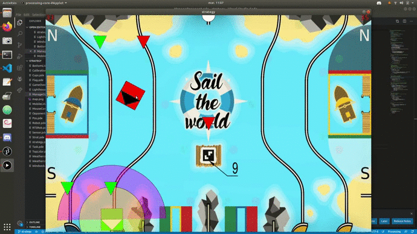
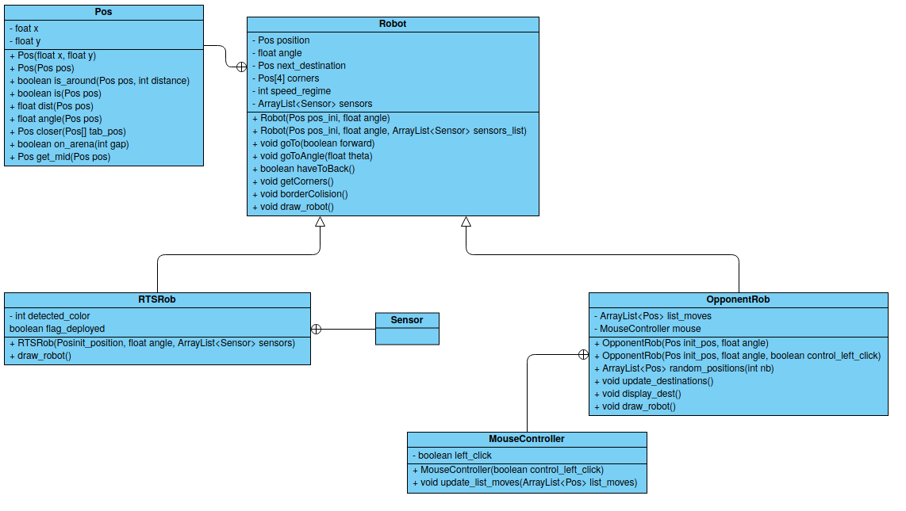
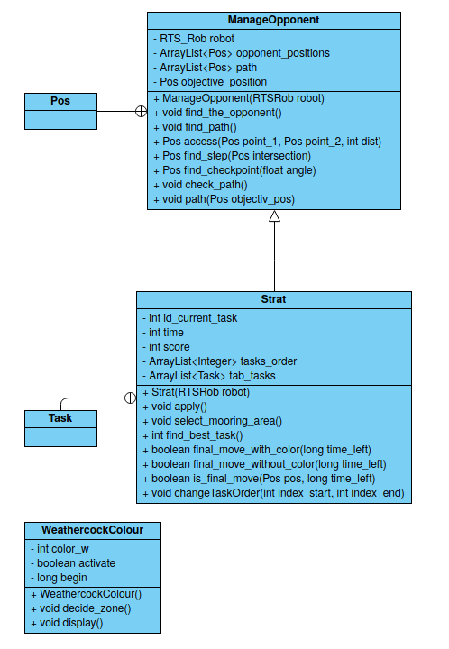
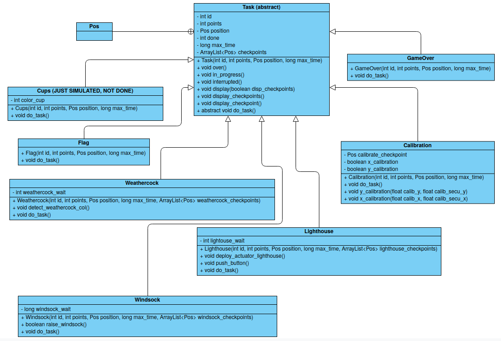

# Strategy-RTS
Creation of the robot strategy for RTS

## Installation

Here is the list of commands to install and start the simulation:

```
git clone git@github.com:info-telecom-strasbourg/strategy-RTS.git
```

At this point, the last update is on the branch `dev`. 
To access it, just enter:

```
git checkout -b strategy origin/strategy
git pull origin dev
```

You can now start the simulation with your processing IDE.


## Expected behaviour

### Robots

In the simulation, there are 2 kind of robots. The <span style="color:green">green one(s) is/are RTS' robot(s)</span>, and the <span style="color:red">red one(s) is/are the opponent's one(s)</span>. The white translucent cone is the area where obstacles are detected. Our robot should slow down if an obstacle is in this area. The green cercle around RTS' robot is the security distance. If the opponent is in the half cercle, RTS' robot should stop.

We also have simulated the behavior of the robot when it collapses with a border of the arena.

### Opponent control

Concerning opponent, you can control it with your mouse. You can choose wich click control the robot (2 robots, 2 clicks). The destination should appear with a number when you create it. You can also deleting a point by pressing the key <span style="color:green">'d'</span>.

### Tasks

The triangles are the tasks locations:

- <span style="color:red">Red</span>: the task is <span style="color:red">not done yet</span>.
- <span style="color:orange">Orange</span>: the task is <span style="color:orange">in progress</span>.
- <span style="color:green">Green</span>: the task is <span style="color:green">done</span>.

> The tasks location depend on the initial position and adapt themselves with the location given.
  
### Weathercock

The weathercock should take a **random color** after 25 seconds (black or white). The mooring area appear when our robot detect the color of the weathercock.

## Little demo




## Adopted strategy
The robot will follow this strategy :
1) If time left < time to go to the mooring area + time to hoist the flag => go to hoist the flag
2) Turn on the light-house
3) Dress the windsocks
4) Detect the weathercock's color

## Futur steps
- Make some tests
- Adapt the code in C++

## Informations
For angles, we chose to have them in [0, 2*Pi].
And 1 pixel in the simulation correspond to 2mm in reality.

## Coding rules
For our classes, we use **Pascal case** (example: `MyClass`) and for our variables/functions, we used **Snake case** (example: `my_varibale`)

## Code organisation
Here is a class diagramm of the project:









## Rules of the competition
You can find the rules of the competition [by clicking here](https://www.coupederobotique.fr/wp-content/uploads/Eurobot2020_Rules_Cup_OFFICIAL_FR.pdf).

## Contributors
- [Hugo LAULLIER](https://github.com/HugoLaullier)
- [Arnaud SCHLUMBERGER](https://github.com/ArnaudSchlumberger)
- [Thomas RIVES](https://github.com/ThomasRives)
- [Thomas LEFEVRE](https://github.com/Zaicu)
- [Jonathan PLASSE](https://github.com/JonathanPlasse)